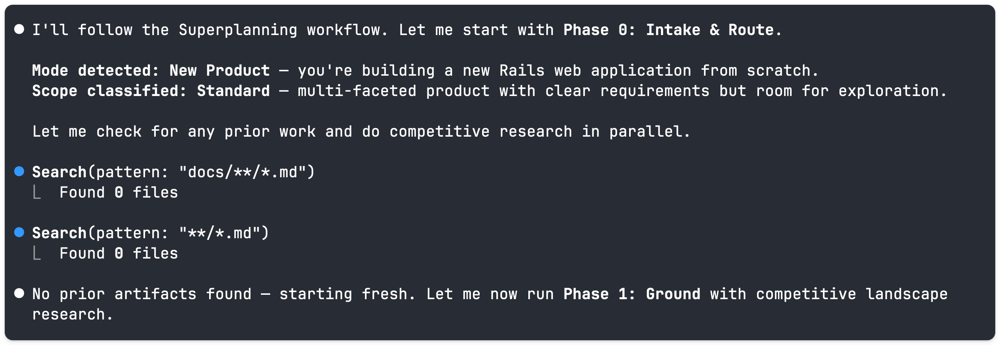

# Superplanning

A unified planning skill for Claude Code that combines the strongest planning techniques from five different skill repositories into one coherent 7-phase flow.

## Why I Built This

As I started using Claude Code more seriously for product work, I noticed something uncomfortable: the best planning techniques were scattered across at least five different skill repositories — compound-engineering, gstack, superpowers, agent-os, and rails-claude-code. Each had something the others didn't. And somehow I wanted to use them all but that will have made the entire process of planning a bit longer and in some cases confusing or at least not pleasant to keep restarting the train of thoughts. 

`office-hours` had the best forcing questions I had seen — six questions that expose the real strength of an idea, each with specific pushback patterns for vague answers. But it didn't have a structured way to turn a validated idea into an implementation plan.

`ce:plan-beta` had the best implementation unit structure — each unit specifying exact file paths, requirements traceability, test scenarios, and verification outcomes. But it didn't have the challenging questions that stress-test whether you're building the right thing in the first place.

`plan-ceo-review` had the best scope discipline — four modes (expand / hold / reduce) committed to throughout, never silently shifted. But it was a standalone review tool, not integrated into a flow.

I kept switching between skills mid-session, copying findings from one into another.

So I analyzed all 48+ planning skills across those five repositories, identified what each one does that no other does, and combined the strongest elements into a single flow. That is `superplanning`.


## What Is Superplanning

**Superplanning** is a single Claude Code skill (but you can install it in any other agentic tool) that handles three planning scenarios — brainstorming an idea, planning a new product from scratch, and planning a new feature for an existing codebase — through a shared 7-phase flow.

The depth at each phase adapts to the mode. You don't need to know which planning skill fits your situation. The skill detects what you're doing and routes accordingly.

## The Problem It Addresses

Most products fail not because the code was bad, they fail because the wrong thing was built. The gap between "idea" and "shipped product users love" is littered with:

- Assumptions that were never challenged
- Requirements that were invented during implementation rather than agreed upfront
- Plans that looked thorough but had no structure for catching failure modes
- Reviews that validated what the builder already believed instead of stress-testing it
- Good intentions that became bad scope — either too narrow to matter or too broad to ship

Superplanning attacks this gap with a structured, opinionated flow that forces the hard questions before a line of code is written. 
All thanks to the people who build the previous skilled and added their own thought process to them. 

The full justification for every design decision is in [design-rationale.md](design-rationale.md).

## Three Modes

| Mode | When to use | What it produces |
|------|------------|-----------------|
| **Brainstorm** | You have an idea and want to explore whether it's worth pursuing, before committing to build anything | Requirements document with stable IDs (R1, R2...), scope boundaries, key decisions, outstanding questions |
| **New Product** | You want to plan a new product from scratch, with no existing codebase | Mission, MVP business plan, roadmap, tech-stack — generated sequentially with approval gates between each |
| **New Feature** | You're adding to an existing codebase and need proper planning before starting | Codebase-grounded implementation plan with exact file paths, dependencies, and test scenarios |

## The 7-Phase Flow

```
Phase 0: INTAKE & ROUTE     — detect mode, check for prior work, classify scope
Phase 1: GROUND             — research context (codebase scan, competitive research)
Phase 2: CHALLENGE & EXPLORE — pressure test the premise before any solution work
Phase 3: DEFINE             — produce requirements doc or product docs
Phase 4: STRUCTURE          — break work into implementation units
Phase 5: VALIDATE           — multi-persona review (CEO → Design → Eng)
Phase 6: DEEPEN             — targeted research on weakest sections (conditional)
Phase 7: HAND OFF           — summary, artifacts, recommended next step
```

Each phase has a gate. The gate question: *"What would the next phase still have to invent if we stopped here?"* If the answer is product behavior, scope boundaries, or success criteria the current phase is not done.

Here is Phase 0 running in practice — detecting the mode and scope, then moving directly into Phase 1:



## What Makes It Different

I analyzed each source skill for what it does that no other skill does. Here is what I found worth preserving.

### Stage-Routed Forcing Questions

The six forcing questions from `office-hours` (Demand Reality, Status Quo, Desperate Specificity, Narrowest Wedge, Observation & Surprise, Future-Fit) are not all asked in every session. They route by product stage:

- Pre-product → Q1, Q2, Q3
- Has users → Q2, Q4, Q5
- Has paying customers → Q4, Q5, Q6
- Pure engineering initiative → Q2, Q4 only

Asking the wrong questions at the wrong stage wastes time and misframes the problem. Asking a team with 500 paying customers to prove demand is insulting. Asking a pre-product founder about their narrowest wedge before validating basic demand skips the foundation.

### Anti-Sycophancy With Specific Prohibitions

Not "be direct" — specific banned phrases with required replacements:

- "That's interesting" → take a position instead
- "There are many ways to think about this" → pick one and state what evidence would change your mind
- "That could work" → say whether it WILL work based on evidence, and what evidence is missing

The rule is: take a position AND state what evidence would change it. Position plus falsifiability condition is more rigorous than tone guidance.

### Confidence Gap Scoring With Selective Deepening

After a plan is drafted, each section is scored: trigger count (checklist problems found) + risk bonus (high-risk domain) + critical-section bonus (Key Decisions, System-Wide Impact, etc.). Only the top 2–5 sections by score are deepened with targeted research.

Generic "improve the plan" instructions produce uniformly padded plans. Scoring and selection concentrates improvement where the plan is actually weakest, not where it's easiest to add words.

### Shadow Path Tracing

> **Shadow Path Tracing**: For every new data flow, trace not just the happy path but three shadow paths: nil input, empty/zero-length input, and upstream error.

This is a concrete, learnable technique — not "handle edge cases" but a specific enumeration of the shadow paths that must be traced for every new data flow. Happy paths are what engineers design. Shadow paths are what users encounter.

### Scope Mode Selection Committed Throughout

At the start of any review, choose one of four modes — SCOPE EXPANSION, SELECTIVE EXPANSION, HOLD SCOPE, SCOPE REDUCTION. The mode is chosen once and never silently shifted.

Review processes without a declared scope mode oscillate. The reviewer expands when expansion feels productive, holds when the founder pushes back, and reduces when running out of time. A committed mode creates a consistent reviewing posture.

### Handoff Completeness Test

The pre-phase-exit check: *"What would the next phase still have to invent if we stopped here?"*

If the answer is product behavior, scope boundaries, or success criteria — the current phase is not done. This makes completion _testable_ rather than _felt_. It's a forcing function that catches lazy handoffs.

The full justification for all 15 integrated concepts — how each one helps product development, how it benefits the end user — is in [design-rationale.md](design-rationale.md).

## Installation

Superplanning is a Claude Code **skill** — a markdown file with instructions that Claude loads and follows. There is no package manager or install command.

### Option 1: Global (available in all projects)

Copy the `skills/superplanning/` folder into your global Claude skills directory:

```bash
cp -r skills/superplanning ~/.claude/skills/superplanning
```

### Option 2: Per-session via `--plugin-dir`

Point Claude Code at the repo root when starting a session:

```bash
claude --plugin-dir /path/to/superplanning
```

### Option 3: Project-local

Copy `skills/superplanning/` into your project's `.claude/skills/` folder. Claude auto-discovers skills there:

```
your-project/
└── .claude/
    └── skills/
        └── superplanning/
            ├── SKILL.md
            └── references/
```

---

## Usage

### Natural Language Triggers

The skill activates automatically from phrases like:

- "brainstorm this idea with me"
- "help me think through whether this is worth building"
- "plan this new product from scratch"
- "we need to add a notification system, needs proper planning"
- "is this worth building?"

### Explicit Invocation

```
superplanning here's my idea: [describe it]
```

Or:

```
Use superplanning to plan this feature: [describe it]
```

---

## File Structure

```
superplanning/
├── README.md                          — this file
├── SOURCES.md                         — attribution for every technique used
├── SKILLS-INVENTORY.md                — inventory of all 48+ source skills analyzed
├── design-rationale.md                — full justification for every design decision
├── existing-skills-insights.md        — unique insights from each source skill
├── plan.md                            — the original implementation plan
├── skills/
│   └── superplanning/
│       ├── SKILL.md                   — the main skill (the unified flow)
│       └── references/
│           ├── forcing-questions.md   — 6 stage-routed forcing questions
│           ├── anti-sycophancy-rules.md — banned phrases and pushback patterns
│           ├── review-personas.md     — 6 review persona definitions
│           └── cognitive-patterns.md  — 45 cognitive patterns by phase
└── tests/
    └── superplanning/
        ├── skill-triggering/          — tests that verify natural language triggers
        ├── explicit-skill-requests/   — tests that verify priority (Skill loads before any action)
        └── unit/                      — behavior verification tests (12 assertions)
```

---

## Sources

This skill draws from 16 source skills across five repositories. Every technique is attributed with what was used and how it was adapted.

The full attribution table is in [SOURCES.md](SOURCES.md).

The repositories analyzed:

- [compound-engineering-plugin](https://github.com/EveryInc/compound-engineering-plugin) — `ce:brainstorm`, `ce:plan-beta`, `ce:ideate`, `deepen-plan-beta`, `document-review`
- [gstack](https://github.com/garrytan/gstack) — `office-hours`, `autoplan`, `plan-ceo-review`, `plan-eng-review`, `plan-design-review`
- [superpowers](https://github.com/obra/superpowers) — `brainstorming`, `writing-plans`, `subagent-driven-development`
- [agent-os](https://github.com/buildermethods/agent-os) — `plan-product`, `shape-spec`
- [rails-claude-code](https://github.com/obie/rails-claude-code) — `mvp-creator`

---

## Testing

Three test layers verify different failure modes:

```bash
# Fast: unit tests only (~2 min) — verify skill content is correct
./tests/superplanning/unit/run-skill-tests.sh

# Verify natural language triggers activate the skill (~30 min)
./tests/superplanning/skill-triggering/run-all.sh

# Verify skill loads BEFORE any action tools (~25 min)
./tests/superplanning/explicit-skill-requests/run-all.sh

# All layers
./tests/run-all-tests.sh
```

## What Superplanning Does Not Do

I want to be clear about what is outside the scope:

- **It does not write code.** Every output is a document, a plan, or a set of requirements. Implementation is a separate phase.
- **It does not replace product judgment.** Taste decisions are surfaced to the human. The skill challenges, structures, and deepens — it does not decide.
- **It does not guarantee market fit.** A plan that survives all phases is a plan with well-examined assumptions. Market fit is a market question, not a planning question.
- **It does not run forever.** Each phase has gates and exits. It is designed to complete in a focused session, not become an infinite refinement loop.

## Feedback

I think this is a genuinely useful synthesis — the integration of stage-routing, anti-sycophancy as structural constraints, and confidence gap scoring makes a real difference compared to using each skill separately.

It might be that I got some things wrong, or that I overweighted certain techniques. If you have feedback or find something that doesn't work as described, please open an issue.

## Resources

- [compound-engineering plugin](https://github.com/EveryInc/compound-engineering-plugin) — source for `ce:brainstorm`, `ce:plan-beta`, `deepen-plan-beta`, `document-review`
- [gstack skills](https://github.com/garrytan/gstack) — source for `office-hours`, `autoplan`, `plan-ceo-review`, `plan-eng-review`, `plan-design-review`
- [superpowers skills](https://github.com/obra/superpowers) — source for `brainstorming`, `writing-plans`
- [agent-os](https://github.com/buildermethods/agent-os) — source for `plan-product`, `shape-spec`
- [rails-claude-code](https://github.com/obie/rails-claude-code) — source for `mvp-creator`
- [Claude Code skills documentation](https://docs.anthropic.com/claude/claude-code) — how to create and install skills
